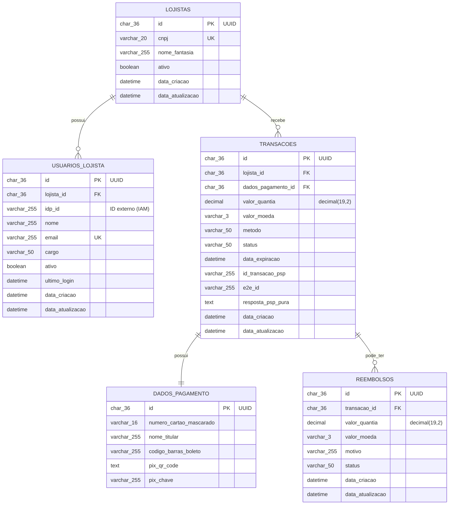

```mermaid
erDiagram
    LOJISTAS ||--o{ USUARIOS_LOJISTA : possui
    LOJISTAS ||--o{ TRANSACOES : recebe
    TRANSACOES ||--|| DADOS_PAGAMENTO : possui
    TRANSACOES ||--o{ REEMBOLSOS : pode_ter

    LOJISTAS {
        char_36 id PK "UUID"
        varchar_20 cnpj UK
        varchar_255 nome_fantasia
        boolean ativo
        datetime data_criacao
        datetime data_atualizacao
    }

    USUARIOS_LOJISTA {
        char_36 id PK "UUID"
        char_36 lojista_id FK
        varchar_255 idp_id "ID externo (IAM)"
        varchar_255 nome
        varchar_255 email UK
        varchar_50 cargo
        boolean ativo
        datetime ultimo_login
        datetime data_criacao
        datetime data_atualizacao
    }

    TRANSACOES {
        char_36 id PK "UUID"
        char_36 lojista_id FK
        char_36 dados_pagamento_id FK
        decimal valor_quantia "decimal(19,2)"
        varchar_3 valor_moeda
        varchar_50 metodo
        varchar_50 status
        datetime data_expiracao
        varchar_255 id_transacao_psp
        varchar_255 e2e_id
        text resposta_psp_pura
        datetime data_criacao
        datetime data_atualizacao
    }

    DADOS_PAGAMENTO {
        char_36 id PK "UUID"
        varchar_16 numero_cartao_mascarado
        varchar_255 nome_titular
        varchar_255 codigo_barras_boleto
        text pix_qr_code
        varchar_255 pix_chave
    }

    REEMBOLSOS {
        char_36 id PK "UUID"
        char_36 transacao_id FK
        decimal valor_quantia "decimal(19,2)"
        varchar_3 valor_moeda
        varchar_255 motivo
        varchar_50 status
        datetime data_criacao
        datetime data_atualizacao
    }
```