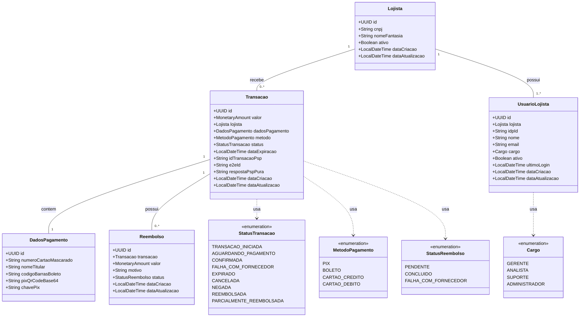

```mermaid
classDiagram
    class StatusTransacao {
        <<enumeration>>
        TRANSACAO_INICIADA
        AGUARDANDO_PAGAMENTO
        CONFIRMADA
        FALHA_COM_FORNECEDOR
        EXPIRADO
        CANCELADA
        NEGADA
        REEMBOLSADA
        PARCIALMENTE_REEMBOLSADA
    }

    class MetodoPagamento {
        <<enumeration>>
        PIX
        BOLETO
        CARTAO_CREDITO
        CARTAO_DEBITO
    }

    class StatusReembolso {
        <<enumeration>>
        PENDENTE
        CONCLUIDO
        FALHA_COM_FORNECEDOR
    }

    class Cargo {
        <<enumeration>>
        GERENTE
        ANALISTA
        SUPORTE
        ADMINISTRADOR
    }

    class Lojista {
        +UUID id
        +String cnpj
        +String nomeFantasia
        +Boolean ativo
        +LocalDateTime dataCriacao
        +LocalDateTime dataAtualizacao
    }

    class UsuarioLojista {
        +UUID id
        +Lojista lojista
        +String idpId
        +String nome
        +String email
        +Cargo cargo
        +Boolean ativo
        +LocalDateTime ultimoLogin
        +LocalDateTime dataCriacao
        +LocalDateTime dataAtualizacao
    }

    class DadosPagamento {
        +UUID id
        +String numeroCartaoMascarado
        +String nomeTitular
        
        +String codigoBarrasBoleto
        +String pixQrCodeBase64
        +String chavePix
    }

    class Transacao {
        +UUID id
        +MonetaryAmount valor
        +Lojista lojista
        +DadosPagamento dadosPagamento
        +MetodoPagamento metodo
        +StatusTransacao status
        +LocalDateTime dataExpiracao
        
        +String idTransacaoPsp
        +String e2eId
        
        +String respostaPspPura
        +LocalDateTime dataCriacao
        +LocalDateTime dataAtualizacao
    }

    class Reembolso {
        +UUID id
        +Transacao transacao
        +MonetaryAmount valor
        +String motivo
        +StatusReembolso status
        +LocalDateTime dataCriacao
        +LocalDateTime dataAtualizacao
    }

    Lojista "1" -- "0..*" Transacao : recebe
    Lojista "1" -- "1..*" UsuarioLojista : possui
    Transacao "1" -- "1" DadosPagamento : contem
    Transacao "1" -- "0..*" Reembolso : possui
    Transacao ..> StatusTransacao : usa
    Transacao ..> MetodoPagamento : usa
    Transacao ..> StatusReembolso : usa
    UsuarioLojista ..> Cargo : usa
```
